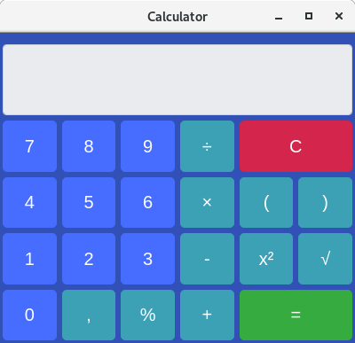
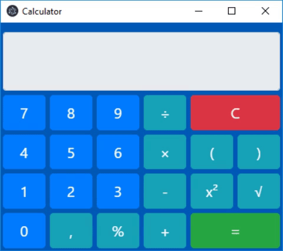

# CalculatorElectronJS

This is a little project to get into ElectronJS







## Installing

Easily clone the repo

```
git clone https://github.com/drzeeb/CalculatorElectronJS.git
```

change the directory

```
cd CalculatorElectronJS
```

and install the dependencies 

```
npm install
```

to start the calculator you have to execute

```
npm start 
```

## Built With

* [Bootstrap 4.1.3](http://getbootstrap.com/) - Frontend Framework
* [ElectronJS 3.0.2](https://electronjs.org/) - Framework to build cross platform desktop apps 
* [Node.js 8.12.0](https://nodejs.org/en/) -  JavaScript runtime
* [mathjs 5.2.3](http://mathjs.org/) - Framework to calculate expressions

## ToDo

* ~~Implement parentheses~~ - *done*
* ~~Implement x², √~~ - *done*
* ~~Implement longer expressions~~ - *done*
* ~~Implement font scaling~~ - *done*
* ~~Improve the printed result, so when there is a result with 1,000 remove the ,000~~ - *done*
* ~~Implement Dark Mode~~ - *done*

## Planned features

* History
* Different themes

## Authors

* **Michael Zeeb** - *The whole work* - [drzeeb](https://github.com/drzeeb/)

## License

This project is licensed under the MIT License - see the [LICENSE](LICENSE) file for details
